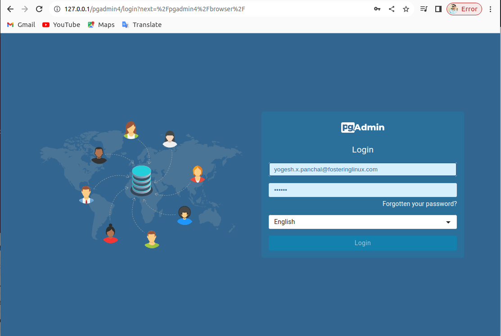
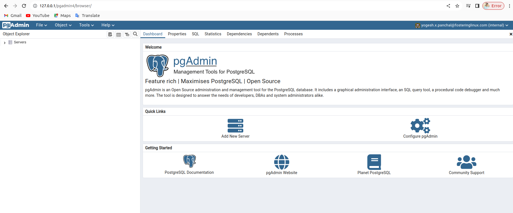
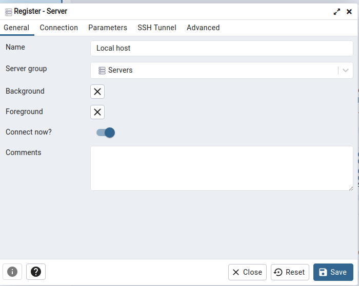
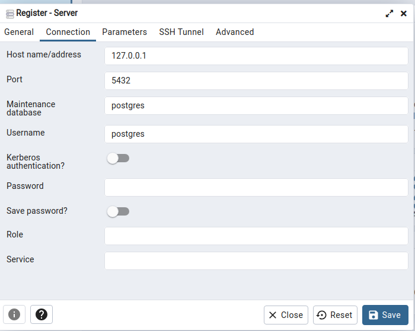
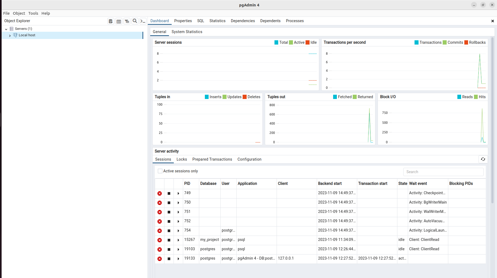

# 
Documentation on Postgresql
 

## Submitted By :- 
### Yogesh

# 
Table of Content

### Task requirement

### Install Podman

### PostgreSQL

### Execute the SQL command to create a table using CRUD operation

### Setup the repository for pgadmin

### Install pgAdmin

### Reference Link

# 
PostgreSQL 

## Task requirement :-

To setup Postgresql and create a table using CRUD operation. 

## Environment details

Description    :	Ubuntu 22.04.3 LTS

Codename     :	jammy

## List of tools and technologies

Postgres and pgAdmin

# PostgreSQL : 

PostgreSQL is a powerful, open source object-relational database system with over 35 years of active development that has earned it a strong reputation for reliability, feature robustness, and performance.

Here, given below the commands to create repository and install postgresql

### Create the file repository configuration:

sudo sh -c 'echo "deb https://apt.postgresql.org/pub/repos/apt $(lsb_release -cs)-pgdg main" > /etc/apt/sources.list.d/pgdg.list'

### Import the repository signing key:

wget --quiet -O - https://www.postgresql.org/media/keys/ACCC4CF8.asc | sudo apt-key add -e

### Update the package lists:

sudo apt-get update

## Install the latest version of PostgreSQL.

### If you want a specific version, use 'postgresql-12' or similar instead of 'postgresql':

sudo apt-get -y install postgresql

### start command for postgreSQL

sudo -i -u postgres

### Create database 

createdb my_project
 
### open database in postgreSQL

psql -d my_project

# Execute the SQL command to create a table using CRUD operation :

### To create a new table : 

CREATE TABLE ritu (

    id INT PRIMARY KEY,

    name VARCHAR(50)

);

### Add data into given table that is created above : 

INSERT INTO ritu (id, name) VALUES (1, 'Yogesh');

 
### Add more data into the given table : 

INSERT INTO ritu (id, name) VALUES               

(2, 'Pushpender'),

(3, 'Rahul'),

(4, 'Rohit');

### Read created table data : 

SELECT * FROM ritu;

* #### Output : 

my_project=# SELECT * FROM ritu;

 id |    name    

----+------------

  1 | Yogesh

  2 | Pushpender

  3 | Rahul

  4 | Rohit

(4 rows)

### Update given table : 

UPDATE ritu

SET name = 'Pushpender dangi'

WHERE id = '2';

* #### Output : 
 
my_project=# SELECT * FROM ritu;

 id |       name       

----+------------------

  1 | Yogesh

  
  3 | Rahul
  
  4 | Rohit
  
  2 | Pushpender dangi

(4 rows)

### Delete data in given table : 

DELETE FROM ritu   

WHERE id = '3';

Output : 

my_project=# SELECT * FROM ritu;

 id |       name       

----+------------------

  1 | Yogesh

  4 | Rohit

  2 | Pushpender dangi

These are the results of CRUD operation.

Setup the repository for pgadmin

## Install the public key for the repository (if not done previously):

curl -fsS https://www.pgadmin.org/static/packages_pgadmin_org.pub | sudo gpg --dearmor -o /usr/share/keyrings/packages-pgadmin-org.gpg

## Create the repository configuration file:

sudo sh -c 'echo "deb [signed-by=/usr/share/keyrings/packages-pgadmin-org.gpg] https://ftp.postgresql.org/pub/pgadmin/pgadmin4/apt/$(lsb_release -cs) pgadmin4 main" > /etc/apt/sources.list.d/pgadmin4.list && apt update'

# Install pgAdmin

## Firstly install pgadmin for desktop from pgadmin.org

### Install for both desktop and web modes:

sudo apt install pgadmin4

### Install for desktop mode only:

sudo apt install pgadmin4-desktop

### Install for web mode only: 

sudo apt install pgadmin4-web 

### Configure the web server, if you installed pgadmin4-web:

sudo /usr/pgadmin4/bin/setup-web.sh

### Link to open pgadmin

http://127.0.0.1/pgadmin4

## For web preview show below image : 

## For Desktop preview and connect to local server :

## Connect to local host : 

# Reference Link :- 

https://youtu.be/tducLYZzElo?si=wnZYgGCEr486aFYR

