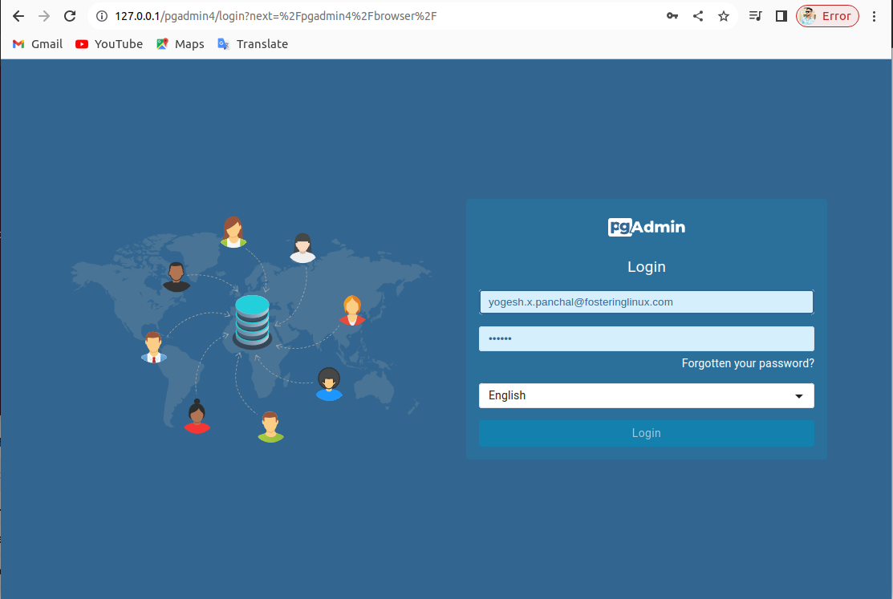
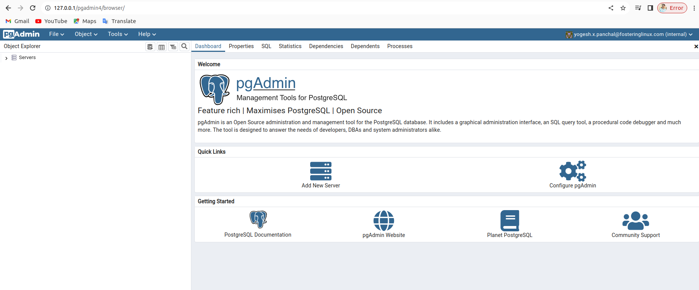
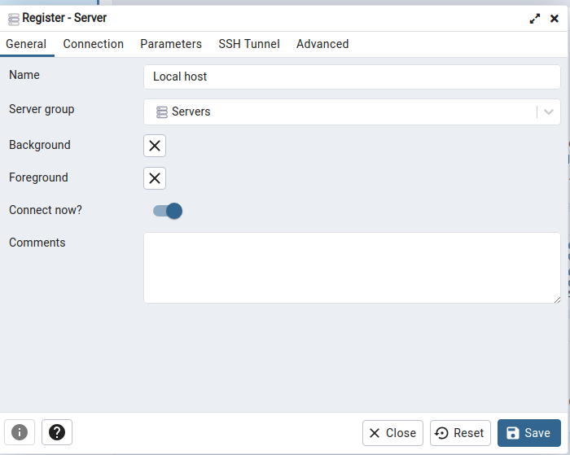
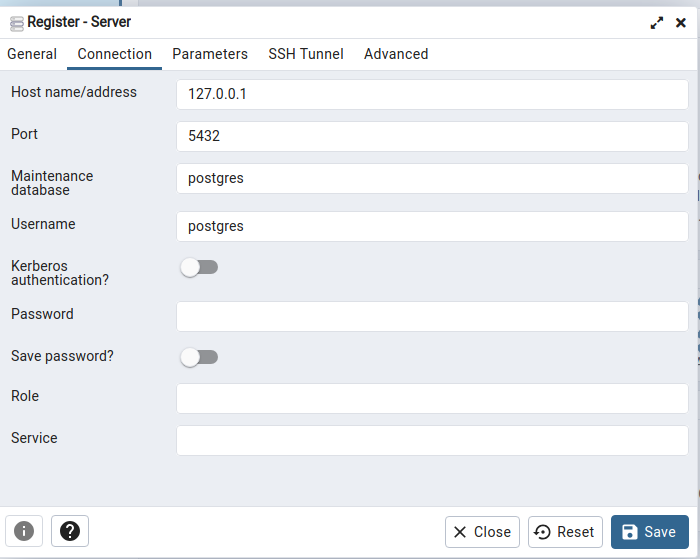
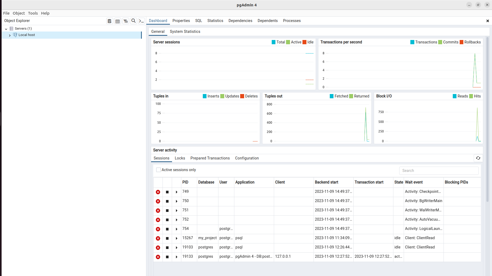

# **
Documentation on Postgresql
** 

**Submitted By :-** 
**Yogesh**

# **
Table of Content
**

[Task requirement](#task-requirement)

[PostgreSQL](#postgresql)

[Execute the SQL command to create a table using CRUD operation](#execute-the-sql-command-to-create-a-table-using-crud-operation)

[Setup the repository for pgadmin](#install-the-public-key-for-the-repository-if-not-done-previously)

[Install pgAdmin](#install-pgadmin)

[Reference Link](#reference-link)

# **
PostgreSQL 
**

# Task requirement

To setup Postgresql and create a table using CRUD operation. 

**Environment details**

Description    :	Ubuntu 22.04.3 LTS

Codename     :	jammy

**List of tools and technologies**

Postgres and pgAdmin

# PostgreSQL 

PostgreSQL is a powerful, open source object-relational database system with over 35 years of active development that has earned it a strong reputation for reliability, feature robustness, and performance.

It's used to store and manage large amounts of data in a structured way. Think of it as a highly organized digital filing cabinet where you can store information efficiently and retrieve it when needed. It's popular because it's reliable, scalable, and offers a wide range of features for managing data.

Here, given below the commands to create repository and install postgresql

**Create the file repository configuration:**

- sudo sh -c 'echo "deb https://apt.postgresql.org/pub/repos/apt $(lsb_release -cs)-pgdg main" > /etc/apt/sources.list.d/pgdg.list'

Sudo - It stands for ‘Superuser do’. It converts a normal user to superuser for a short time.

sh -c - It is a part that lets you run a command in a new shell.

echo - The command in linux is used to print or display text and or variables on the terminal.

lsb_release - It stands for "Linux Standard Base release.It is used to provide certain information about the Linux distribution you're using.

**Import the repository signing key:**

- wget --quiet -O - https://www.postgresql.org/media/keys/ACCC4CF8.asc | sudo apt-key add -e

wget - It is a command-line utility used in linux to retrieve files from the web.

--quiet - It's often used to run commands silently without displaying unnecessary information.

-O - It is stands for "output" or "output file" and is used to specify the output destination or file in commands

**Update the package lists:**

- sudo apt-get update

Sudo - It stands for ‘Superuser do’. It converts a normal user to superuser for a short time.

apt - It is used to install any package. It is only used in Ubuntu.

Update - To update any package.

**Install the latest version of PostgreSQL.**

- sudo apt-get -y install postgresql

Sudo - It stands for ‘Superuser do’. It converts a normal user to superuser for a short time.

apt - It is used to install any package. It is only used in Ubuntu.

**start command for postgreSQL**

- sudo -i -u postgres

Sudo - It stands for ‘Superuser do’. It converts a normal user to superuser for a short time.

-i - The -i flag (or --login) is used to simulate a full initial login for the specified user (postgres in this case).

-u - use it for updates.

**Create database** 

- createdb my_project

createdb - It is used to create databases.

my_project - It is  a file name.

 
**open database in postgreSQL**

- psql -d my_project

psql - It is used to interact with postgresql.

-d my_project - The -d flag specifies the database name (my_project in this case) to which you want to connect. It indicates that you want to interact with the PostgreSQL database named my_project.

# Execute the SQL command to create a table using CRUD operation

**CRUD** stands for Create, Read, Update, and Delete, which represents the four basic functions that can be performed on most database systems and forms the foundation of persistent storage and data manipulation.

**Create:** Involves adding new data records to a database. It's about inserting new entries into the database, creating new entities, or adding new rows to a table.

**Read:** Involves retrieving or reading existing data from a database. This operation fetches and displays data, allowing you to view or access the stored information.

**Update:** Involves modifying existing data in a database. This operation allows you to change or update the information already stored. It could be updating specific fields in a record or altering the entire record.

**Delete:** Involves removing data from a database. This operation allows the deletion of existing records or entries, effectively removing them from the database.

**Data type -** A data type is a classification that specifies the type of data that a variable, column, or object can hold in programming languages or databases. 

**Type of Data:** It defines the kind of data that can be stored, such as integers, numbers, characters, boolean values, etc.

**Primary key -** A primary key in a database is a special field or combination of fields that uniquely identifies each record (or row) in a table. It serves as a unique identifier for each row, ensuring that there are no duplicate or null values within that key column or set of columns.

**To create a new table :** 

- CREATE TABLE ritu (

    id INT PRIMARY KEY,

    name VARCHAR(50)

);

**Add data into given table that is created above :** 

- INSERT INTO ritu (id, name) VALUES (1, 'Yogesh');

 
**Add more data into the given table :** 

- INSERT INTO ritu (id, name) VALUES               

(2, 'Pushpender'),

(3, 'Rahul'),

(4, 'Rohit');

**Read created table data :** 

- SELECT * FROM ritu;

* **Output :** 

my_project=# SELECT * FROM ritu;

 id |    name    

----+------------

  1 | Yogesh

  2 | Pushpender

  3 | Rahul

  4 | Rohit

(4 rows)

**Update given table :** 

UPDATE ritu

SET name = 'Pushpender dangi'

WHERE id = '2';

* **Output :** 
 
my_project=# SELECT * FROM ritu;

 id |       name       

----+------------------

  1 | Yogesh

  
  3 | Rahul
  
  4 | Rohit
  
  2 | Pushpender dangi

(4 rows)

**Delete data in given table :** 

- DELETE FROM ritu   

WHERE id = '3';

Output : 

my_project=# SELECT * FROM ritu;

 id |       name       

----+------------------

  1 | Yogesh

  4 | Rohit

  2 | Pushpender dangi

These are the results of CRUD operation.

Setup the repository for pgadmin

## Install the public key for the repository (if not done previously):

What is a public key? Why do we need to install public keys in repositories?

The public key is shared openly and can be freely distributed, while the corresponding private key is kept secret. The public key is used to encrypt data or verify digital signatures, and the private key is used to decrypt the data or create digital signatures.

We need to install public keys in repositories to secure communication, trust and verification ,security and Integrity, etc.

- curl -fsS https://www.pgadmin.org/static/packages_pgadmin_org.pub | sudo gpg --dearmor -o /usr/share/keyrings/packages-pgadmin-org.gpg

curl - Client URL(Uniform Resource Locator).It is used to sending or retrieve data from the web page. 

gpg - ‘GNU Privacy Guard’, It is used for encryption,decryption and signing operations, primarily focusing on security data. 

**Create the repository configuration file:**

- sudo sh -c 'echo "deb [signed-by=/usr/share/keyrings/packages-pgadmin-org.gpg] https://ftp.postgresql.org/pub/pgadmin/pgadmin4/apt/$(lsb_release -cs) pgadmin4 main" > /etc/apt/sources.list.d/pgadmin4.list && apt update'

Sudo - It stands for ‘Superuser do’. It converts a normal user to superuser for a short time.

sh -c - It is a part that lets you run a command in a new shell.

echo - The command in linux is used to print or display text and or variables on the terminal.

# Install pgAdmin

PGAdmin is a web-based Graphical User Interface (GUI) management application used to communicate with Postgres and derivative relational databases on both local and remote servers.

**Firstly install pgadmin for desktop from pgadmin.org**

**Install for both desktop and web modes:**

- sudo apt install pgadmin4

**Install for desktop mode only:**

- sudo apt install pgadmin4-desktop

**Install for web mode only:** 

- sudo apt install pgadmin4-web 

**Configure the web server, if you installed pgadmin4-web:**

- sudo /usr/pgadmin4/bin/setup-web.sh

**Link to open pgadmin**

http://127.0.0.1/pgadmin4

**For web preview show below image :** 

 

**For Desktop preview and connect to local server :**

**Connect to local host :** 

# Reference Link 

https://youtu.be/tducLYZzElo?si=wnZYgGCEr486aFYR

